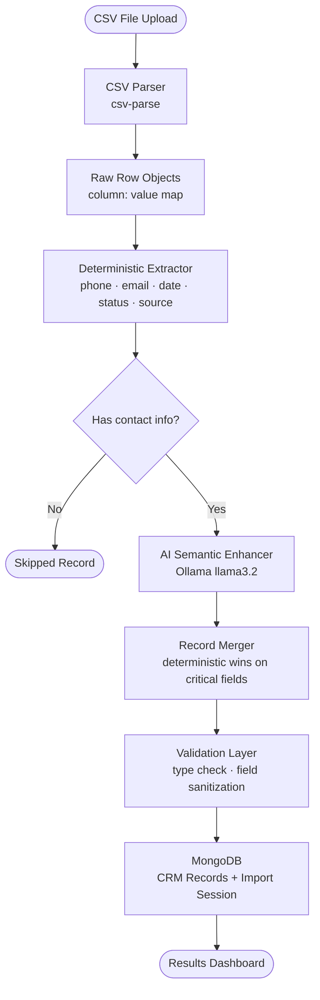
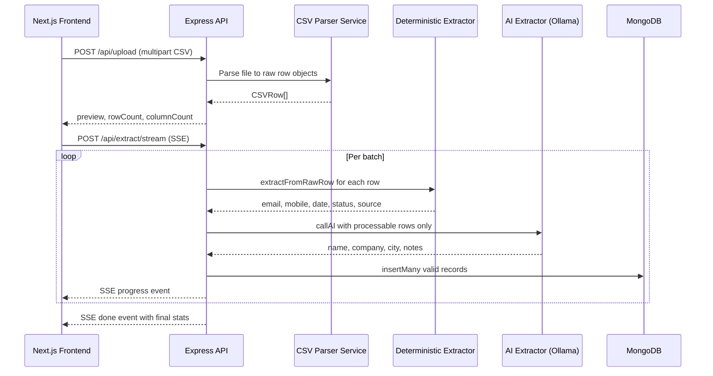
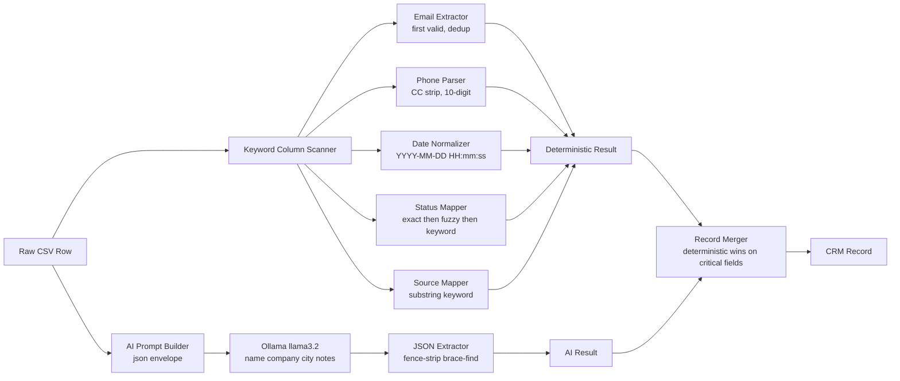

# GrowEasy — AI CSV Importer

> AI-powered intelligent CSV importer that converts arbitrary lead datasets into standardized CRM records using LLM-driven semantic extraction and a deterministic normalization pipeline.

<p align="center">
  
  
  
  
  
  
  
  
</p>

---

## Project Overview

### The Problem

Enterprise CRM teams routinely import lead data from dozens of sources — trade shows, digital campaigns, third-party lead vendors, scraped directories, and manual spreadsheets. Each source ships data in its own schema: column names differ wildly (`"Full Name"` vs `"Lead"` vs `"Customer Name"`), phone numbers arrive in every conceivable format (`+91-98765 43210`, `919876543210`, `9876543210`), emails are duplicated across columns, statuses use free-text strings (`"Interested"`, `"Not picking up"`, `"Deal done"`), and entire rows shift columns depending on the export template used.

### Why Traditional Importers Fail

Traditional CSV importers rely on **exact column name matching** or **user-driven field mapping wizards**. Both approaches break the moment a new source changes a header. They require re-mapping for every unique template, discard structurally valid data because it does not match the expected column position, and cannot interpret semantic intent — they cannot know that `"Not interested currently"` maps to `BAD_LEAD` or that a row missing a `"Phone"` column might still carry a number in `"WhatsApp"` or `"Contact Number"`.

### The Solution

GrowEasy AI CSV Importer uses a **deterministic-first, AI-enhanced** pipeline:

1. **Deterministic extraction** runs on every row in pure code — scanning all column names by keyword heuristics to extract phone numbers, emails, dates, statuses, and data sources. This layer is fast, testable, and 100% reliable.
2. **LLM semantic extraction** handles what deterministic rules cannot — inferring `name`, `company`, `city`, `lead_owner`, `description`, and `notes` from unstructured or ambiguous column layouts.
3. The two layers are **merged with deterministic values always winning** for critical fields (phone, email, status, source), and AI values filling semantic gaps.

The result: any CSV, any column schema, any layout — correctly parsed in a single upload.

---

## 💡 Why Ollama Instead of Paid AI APIs?

Most AI-powered tools today are built on top of **paid cloud APIs** — OpenAI, Google Gemini, Anthropic Claude, Groq — where every token processed costs money and every API key is a billing liability. This project deliberately avoids that pattern entirely.

Instead, it uses **[Ollama](https://ollama.com)** — a free, open-source local LLM runtime that runs `llama3.2` (and dozens of other open-weight models) entirely on your own machine:

- **Zero cost, forever** — No API key, no credit card, no rate-limit billing surprises. You can process 10 rows or 10 million rows and the bill stays at $0.
- **Complete data privacy** — Your CSV files, lead data, and extracted records never leave your machine. Nothing is sent to a third-party server. This matters when handling real customer contact information.
- **No internet dependency** — Works fully offline. No API outages, no quota exhaustion mid-import, no degraded performance during provider incidents.
- **Model flexibility** — Switching from `llama3.2` to `mistral`, `phi3`, `gemma2`, or any other Ollama model is a single `.env` change — no code modification required.
- **Same interface as paid APIs** — Ollama exposes an OpenAI-compatible REST API, so the codebase uses the standard `openai` SDK. If you ever want to switch to a paid provider, it is a two-line environment variable change, not a refactor.

The trade-off: local models are slower than cloud APIs on low-end hardware. On a modern laptop with 16GB RAM, `llama3.2 3B` processes a 100-row batch in roughly 15–30 seconds — fast enough for the import workflow this tool is designed for.

---

## Features

| Feature | Description |
|---|---|
| **AI Semantic Mapping** | LLM maps arbitrary column names to CRM fields without user configuration |
| **Deterministic Phone Parsing** | Handles `+CC-XXXXXXXX`, `00CCXXXXXXXX`, raw 10-digit, multi-number columns |
| **Email Normalization** | Extracts first valid email from semicolon/comma-delimited multi-email fields |
| **Status Normalization** | Maps 30+ free-text status strings to four canonical CRM statuses |
| **Source Normalization** | Substring keyword matching maps project names to canonical data source enums |
| **Intelligent Skip Logic** | Rows missing both email and mobile are skipped deterministically — not by AI |
| **Sparse Layout Support** | Each CSV row is treated independently; column positions are irrelevant |
| **Streaming Extraction** | SSE-based streaming delivers batch-by-batch progress to the UI in real time |
| **Batch Processing** | Configurable batch size with exponential backoff retry per batch |
| **Import Statistics** | Imported count, skipped count, skip reasons, processing time |
| **MongoDB Persistence** | Full lead records and import sessions stored with timestamps |
| **Import History** | Browse, search, and re-export past import sessions |
| **CSV Export** | Download extracted CRM records as a clean CSV |
| **Responsive SaaS UI** | Mobile-first Next.js interface with dark mode and animated transitions |
| **Zero Cloud Cost** | Runs entirely on a local Ollama model — no API keys, no billing |

---

## Architecture

### High-Level System Architecture



### Backend Request Flow



### AI Processing Pipeline



### Project Structure

```
groweasy-csv-importer/
│
├── nextjs-app/                       # Frontend (Next.js 16, App Router)
│   ├── app/
│   │   ├── page.tsx                  # Root page — upload → preview → results flow
│   │   ├── layout.tsx                # Root layout with font and metadata
│   │   └── globals.css               # Global styles and CSS variables
│   ├── components/
│   │   ├── layout/Header.tsx         # Fixed header — logo, history, theme toggle
│   │   ├── upload/UploadZone.tsx     # Drag-and-drop file upload zone
│   │   ├── preview/PreviewPage.tsx   # Virtualized CSV preview table
│   │   ├── results/ResultsPage.tsx   # Stats, imported/skipped tabs, CSV export
│   │   ├── history/HistoryPage.tsx   # Past import session browser
│   │   └── shared/
│   │       ├── DataTable.tsx         # Reusable scrollable table with live search
│   │       └── ProcessingOverlay.tsx # Animated extraction progress overlay
│   ├── hooks/
│   │   ├── useDarkMode.ts            # Dark mode with localStorage persistence
│   │   └── useFileUpload.ts          # File drag/drop/select logic
│   ├── lib/
│   │   ├── api.ts                    # Typed API client (upload, stream, health)
│   │   └── constants.ts              # CRM status labels, colors, source display names
│   └── types/index.ts                # Shared TypeScript interfaces
│
├── server/                           # Backend API (Express + TypeScript)
│   ├── src/
│   │   ├── config/
│   │   │   ├── env.ts                # Typed env variable loader with validation
│   │   │   └── openai.ts             # OpenAI-compatible client factory (Ollama)
│   │   ├── controllers/
│   │   │   └── upload.controller.ts  # HTTP handler — parse, extract, stream SSE
│   │   ├── middleware/logger.ts       # Winston structured logger
│   │   ├── routes/upload.routes.ts   # Express route definitions
│   │   ├── services/
│   │   │   ├── aiExtractor.service.ts  # Core extraction pipeline (det + AI)
│   │   │   ├── csvParser.service.ts    # CSV file to CSVRow[] via csv-parse
│   │   │   └── db.service.ts           # MongoDB persistence
│   │   ├── types/index.ts             # CRMRecord, AIExtractionResult, enums
│   │   └── utils/
│   │       ├── csvHelpers.ts          # normalizeCRMStatus normalizeDataSource normalizeDate
│   │       └── retry.ts               # Exponential backoff withRetry utility
│   └── src/__tests__/                 # Jest unit tests — 47 cases
│
└── README.md
```

---

## Tech Stack

### Frontend

| Technology | Version | Purpose |
|---|---|---|
| Next.js | 16 App Router | React framework with SSR, routing, and Turbopack |
| TypeScript | 5.x | Static typing across all components and hooks |
| Tailwind CSS | v4 | Utility-first CSS with dark mode and custom tokens |
| shadcn/ui + Radix UI | Latest | Accessible headless UI primitives |
| Lucide React | Latest | Consistent icon set |
| Sonner | Latest | Toast notification system |

### Backend

| Technology | Version | Purpose |
|---|---|---|
| Node.js | 20+ | JavaScript runtime |
| Express | 4.x | HTTP server and middleware pipeline |
| TypeScript | 5.x | Type-safe server code |
| tsx | 4.x | Zero-config TypeScript execution |
| csv-parse | 5.x | Robust CSV parsing with relaxed column count |
| Winston | 3.x | Structured logging |
| Helmet | Latest | HTTP security headers |
| express-rate-limit | Latest | Abuse prevention |

### AI Layer

| Technology | Purpose |
|---|---|
| Ollama | Local LLM runtime — serves `llama3.2` via OpenAI-compatible REST API |
| llama3.2 3B | Open-weight language model for semantic field extraction |
| openai SDK | Used as a client against the Ollama endpoint |

### Database

| Technology | Purpose |
|---|---|
| MongoDB | Document store for CRM lead records and import session metadata |
| Native Driver | Schema validation and query building |

### Developer Experience

| Tool | Purpose |
|---|---|
| Jest + ts-jest | Unit testing with TypeScript support |
| Docker + Docker Compose | Reproducible full-stack dev and deployment environment |
| dotenvx | Typed `.env` injection with override support |

---

## Database Schema

### CRM Lead Record

| Field | Type | Description |
|---|---|---|
| `_id` | ObjectId | MongoDB document identifier |
| `created_at` | String | Lead creation timestamp — `YYYY-MM-DD HH:mm:ss` |
| `name` | String | Full name of the lead (title-cased) |
| `email` | String | Primary email address (lowercase) |
| `country_code` | String | Phone country code — e.g. `+91`, `+1` |
| `mobile_without_country_code` | String | 10-digit mobile number (digits only) |
| `company` | String | Company or organization name |
| `city` | String | City |
| `state` | String | State or province |
| `country` | String | Country |
| `lead_owner` | String | Assigned sales rep email or name |
| `crm_status` | Enum | `GOOD_LEAD_FOLLOW_UP` · `DID_NOT_CONNECT` · `BAD_LEAD` · `SALE_DONE` |
| `crm_note` | String | Aggregated notes, remarks, extra emails, extra phone numbers |
| `data_source` | Enum | `leads_on_demand` · `meridian_tower` · `eden_park` · `varah_swamy` · `sarjapur_plots` |
| `possession_time` | String | Property possession timeline |
| `description` | String | Additional freeform description |
| `session_id` | ObjectId | Reference to the parent import session |
| `imported_at` | Date | Server-side insertion timestamp |

### Import Session Record

| Field | Type | Description |
|---|---|---|
| `_id` | ObjectId | Session identifier |
| `filename` | String | Original uploaded filename |
| `total_rows` | Number | Total CSV rows parsed |
| `imported_count` | Number | Records successfully saved |
| `skipped_count` | Number | Records skipped (missing contact info) |
| `processing_time_ms` | Number | End-to-end extraction duration in milliseconds |
| `created_at` | Date | Session creation timestamp |
| `skipped_details` | Array | Per-row skip reasons and raw data snapshot |

---

## API Documentation

### `POST /api/upload`

Parses a CSV file and returns a preview of the parsed rows.

**Request**
```
Content-Type: multipart/form-data
file: <CSV file>
```

**Response `200 OK`**
```json
{
  "success": true,
  "data": {
    "preview": {
      "headers": ["Full Name", "Email Address", "Phone", "Status"],
      "rows": [
        {
          "Full Name": "John Doe",
          "Email Address": "john@example.com",
          "Phone": "+91-9876543210",
          "Status": "Interested"
        }
      ],
      "rowCount": 142,
      "columnCount": 4
    }
  }
}
```

---

### `POST /api/extract/stream`

Runs the full extraction pipeline over all CSV rows. Returns an **SSE stream** with per-batch progress and a final summary event.

**Request**
```json
{
  "csvData": [
    {
      "Full Name": "John Doe",
      "Email Address": "john@example.com",
      "Phone": "+91-9876543210"
    }
  ],
  "filename": "leads_q1_2026.csv"
}
```

**SSE — Progress Event**
```
data: {"type":"progress","batchIndex":0,"totalBatches":3,"totalImported":5,"totalSkipped":1}
```

**SSE — Done Event**
```json
{
  "type": "done",
  "records": [
    {
      "name": "John Doe",
      "email": "john@example.com",
      "country_code": "+91",
      "mobile_without_country_code": "9876543210",
      "crm_status": "GOOD_LEAD_FOLLOW_UP",
      "data_source": "meridian_tower"
    }
  ],
  "skipped": [
    {
      "rowIndex": 4,
      "reason": "Missing both email and mobile number",
      "rawData": { "Notes": "No phone and no email", "Name": "Unknown Person" }
    }
  ],
  "totalImported": 5,
  "totalSkipped": 1,
  "processingTimeMs": 14200,
  "sessionId": "6690abc123def456"
}
```

**Validation Rules**

- `csvData` must be a non-empty array of objects
- Each record must contain at least one valid email address or mobile number to be imported
- `crm_status` must normalize to one of the four valid enum values or remain empty
- `data_source` must match a known project keyword or remain empty

---

## Installation

### Prerequisites

- Node.js >= 20
- MongoDB >= 7 (local instance or Atlas)
- [Ollama](https://ollama.com) installed and running

### 1. Clone the repository

```bash
git clone https://github.com/your-username/groweasy-csv-importer.git
cd groweasy-csv-importer
```

### 2. Pull the Ollama model

```bash
ollama pull llama3.2
ollama serve    # keep running in a separate terminal
```

### 3. Configure the backend

```bash
cd server
cp .env.example .env
# Edit .env — set MONGODB_URI and confirm OLLAMA_BASE_URL
npm install
```

### 4. Configure the frontend

```bash
cd ../nextjs-app
cp .env.local.example .env.local
# Edit .env.local — set NEXT_PUBLIC_API_BASE_URL=http://localhost:3001/api
npm install
```

### 5. Start development servers

```bash
# Terminal 1 — Backend API
cd server && npm run dev

# Terminal 2 — Next.js Frontend
cd nextjs-app && npm run dev
```

Open [http://localhost:3000](http://localhost:3000).

---

## Environment Variables

### Backend — `server/.env`

| Variable | Description | Required |
|---|---|---|
| `PORT` | Express server bind port | No — default `3001` |
| `NODE_ENV` | `development` or `production` | No — default `development` |
| `MONGODB_URI` | MongoDB connection string | **Yes** |
| `OLLAMA_BASE_URL` | Ollama OpenAI-compatible API base URL | No — default `http://localhost:11434/v1` |
| `AI_MODEL` | Ollama model name | No — default `llama3.2` |
| `AI_MAX_TOKENS` | Maximum token budget per AI call | No — default `16000` |
| `AI_BATCH_SIZE` | CSV rows per AI call | No — default `5` |
| `AI_MAX_RETRIES` | Retry attempts per failed batch | No — default `3` |
| `MAX_FILE_SIZE_MB` | Maximum accepted upload size | No — default `10` |

### Frontend — `nextjs-app/.env.local`

| Variable | Description | Required |
|---|---|---|
| `NEXT_PUBLIC_API_BASE_URL` | Backend API base URL exposed to the browser | **Yes** |

---

## Example CSV

The importer handles sparse, multi-template CSV files where each row may use entirely different columns:

```csv
Timestamp,Full Name,Email Address,Alt Email,Phone,Company Name,Status,Source,Notes,Created On,Customer Name,Contact Number,Mail ID,Remarks,Owner,Project,Date,Lead,WhatsApp,Comments,Lead Status
2026-05-13 14:20:48,John Doe,john.doe@example.com,john.alt@gmail.com,+91-9876543210,Acme Corp,Interested,meridian_tower,Demo requested,,,,,,,,,,,,
,,,,,,,,,,14/05/2026,Sarah Johnson,9876543211,sarah@example.com,Busy call later,agent@crm.ai,eden_park,,,,
,,,,,,,,,,,,,,,,,2026-05-15,Rajesh Patel,+91 98765 43212,rajesh@startup.io,Not interested,Not Interested
,,priya@work.com;priya.personal@gmail.com,,,Closed Won,,sarjapur_plots,,,,,,,,,May 16 2026,Priya Singh,919876543213,+91 9999999999,Deal closed
2026-05-18,,,,,+1-555-123-4567,,,No Answer,,,,,,,,,,,Emily Chen,emily@global.com,,New York,USA
```

**Output:** 5 imported, 1 skipped — phones normalized, emails deduplicated, statuses mapped, sparse layouts resolved.

---

## Performance Optimizations

- **Deterministic pre-screening** — Rows without contact info are eliminated before any AI call, reducing token consumption by up to 20% on typical lead datasets.
- **Batch processing** — AI calls are chunked into configurable batches (default: 5 rows), limiting prompt size and enabling incremental result delivery via SSE before all rows are processed.
- **Provider abstraction** — The AI layer uses the OpenAI SDK client interface. Switching from Ollama to any OpenAI-compatible endpoint requires only environment variable changes — zero code changes.
- **Exponential backoff** — Transient AI failures retry with exponential backoff (base 2s, cap 30s), preventing thundering herds against the local model.
- **Virtualized table rendering** — The CSV preview renders only the visible rows, keeping the browser responsive for files with 50,000+ rows.
- **SSE streaming** — The frontend receives and renders batch results incrementally rather than blocking on a single large HTTP response.

---

## Security Considerations

- **Server-side secrets** — All credentials (MongoDB URI, Ollama URL) are stored exclusively in server-side environment variables. No secrets are exposed to the browser.
- **Input validation** — Uploaded files are validated for MIME type and size before parsing. Malformed CSV is rejected with a descriptive error rather than causing a server crash.
- **Output sanitization** — All AI-generated string values are coerced, trimmed, and newlines are escaped before persistence to prevent CSV injection in exports.
- **HTTP security headers** — The Express server uses `helmet` to set `Content-Security-Policy`, `X-Frame-Options`, `Strict-Transport-Security`, and related headers on every response.
- **Rate limiting** — Upload and extraction endpoints are protected by `express-rate-limit` to prevent abuse and resource exhaustion.

---

## Scalability

The architecture is designed to scale horizontally without breaking changes:

- **Multiple AI providers** — The `callAI` function accepts any OpenAI-compatible client. A provider factory can route requests to GPT-4o, Claude, or Groq based on cost, latency, or capability tier with no changes to the extraction pipeline.
- **Multiple CRM targets** — The normalization pipeline outputs a standard `CRMRecord` interface. An adapter layer can transform this into Salesforce objects, HubSpot contacts, or Zoho leads without modifying the extraction logic.
- **Queue-backed batch processing** — The current synchronous batch loop can be replaced with BullMQ or SQS, enabling distributed processing across multiple worker nodes and supporting files with millions of rows.
- **Background workers** — The `extractCRMRecordsStreaming` function is designed to run inside a worker process. Decoupling it from the HTTP handler allows WebSocket or polling-based progress for long-running asynchronous jobs.
- **Horizontal scaling** — The backend is fully stateless between requests. Load balancing across multiple instances requires only a shared MongoDB connection and a Redis pub/sub layer for SSE delivery.

---

## Running Tests

```bash
cd server

# All unit tests
npm test

# Watch mode during development
npm run test:watch

# Coverage report
npm run test:coverage
```

| Module | Test Cases | Coverage Areas |
|---|---|---|
| `normalizeCRMStatus` | 25 | Exact enum, fuzzy map, substring fallback, edge cases, ordering |
| `normalizeDataSource` | 12 | Exact match, keyword substring, mixed-case, invalid input |
| `normalizeDate` | 5 | ISO 8601, datetime string, slash-delimited, month-name, invalid |
| `extractJSONFromText` | 6 | Plain JSON, markdown fences, prose-embedded, truncated fence |

---

## Future Improvements

| Priority | Feature | Description |
|---|---|---|
| High | **Queue-based ingestion** | BullMQ workers decouple upload from extraction — supports millions of rows without HTTP timeouts |
| High | **WebSocket progress** | Bidirectional state enables pause, cancel, and per-row retry without full re-upload |
| Medium | **Multi-provider routing** | Dynamic routing between Ollama, OpenAI, and Groq based on availability and latency SLAs |
| Medium | **Custom field mapping UI** | Allow users to override AI-generated field mappings before committing to the database |
| Medium | **Duplicate detection** | Pre-import deduplication using email and mobile as composite keys against existing CRM records |
| Low | **Multiple CRM adapters** | Pluggable adapters to export `CRMRecord` directly to Salesforce, HubSpot, or Zoho |
| Low | **Scheduled imports** | Cron-triggered imports from S3, SFTP, or Google Sheets via connector plugins |

---

## Author

**Somsubhro**

- GitHub: [@somsubhro](https://github.com/somsu123)


---

## License

This project is licensed under the [MIT License](./LICENSE).

```
MIT License — Copyright (c) 2026 Somsubhro

Permission is hereby granted, free of charge, to any person obtaining a copy
of this software and associated documentation files (the "Software"), to deal
in the Software without restriction, including without limitation the rights
to use, copy, modify, merge, publish, distribute, sublicense, and/or sell
copies of the Software, and to permit persons to whom the Software is
furnished to do so, subject to the following conditions:

The above copyright notice and this permission notice shall be included in all
copies or substantial portions of the Software.

THE SOFTWARE IS PROVIDED "AS IS", WITHOUT WARRANTY OF ANY KIND, EXPRESS OR
IMPLIED, INCLUDING BUT NOT LIMITED TO THE WARRANTIES OF MERCHANTABILITY,
FITNESS FOR A PARTICULAR PURPOSE AND NONINFRINGEMENT.
```
